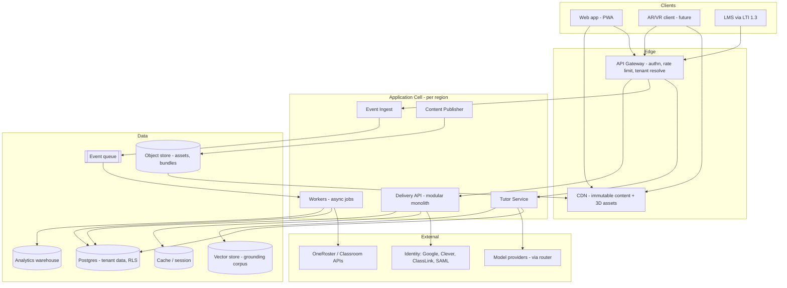
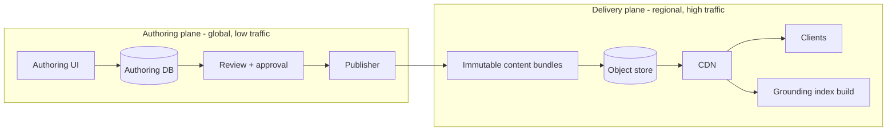
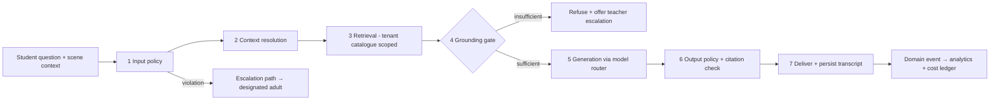

# Anatomy Atelier — Version 2 Target Architecture

**Author role:** Principal Software Architect
**Date:** 2026-08-06
**Status:** Design intent. No implementation code is proposed here.
**Companion documents:** `ANATOMY_ANALYSIS_AND_BLUEPRINT.md` (current-state analysis), `ANATOMY_STEP8_PRODUCT_STRATEGY.md` (prioritization)

---

# 0. Purpose and Framing

Version 1 is a beautiful single-tenant 3D viewer: one route, nine hardcoded organs in `app/lib/anatomy-data.ts`, six `useState` hooks holding all application state, zero backend, zero tests, zero AI. It is an excellent prototype and a poor foundation.

This document designs **Version 2 as if Version 1 did not exist**, then explains how to get there. The target is a commercial platform serving thousands of schools across multiple countries, with teacher dashboards, student accounts, AI tutoring, analytics, offline classrooms, and an eventual AR/VR surface.

**The design test applied to every decision below:**

> Will this choice still be correct at 5,000 schools, in 8 languages, across 3 data-residency regions, with an AR client we have not built yet — or will it require a rewrite?

Anything that fails that test is rejected here, even when it would ship faster.

## 0.1 The four architectural mistakes we are designing against

Each is a real, verified property of V1 that would become catastrophic at scale. They are named here because every section below exists to prevent one of them.

| V1 property | Where | Why it breaks at scale |
|---|---|---|
| **Content lives in code** | `app/lib/anatomy-data.ts` — 312 lines of literals; hotspot XYZ hand-tuned against the `FIT_SIZE = 3.8` cube | Adding an organ needs a deploy. Localization is impossible. 200+ structures across 8 languages × 3 reading levels = an unmaintainable source file. |
| **Rendering is the domain** | `OrganViewer.tsx` speaks Three.js directly; `viewer.ts` owns camera, tools, and semantics together | An AR client cannot reuse anything. WebGPU migration is a rewrite. There is no non-visual representation of the scene for assistive technology. |
| **State is component state** | Six `useState` in `AnatomyApp.tsx:70-75` | No multi-user, no persistence, no offline, no sync, no analytics. |
| **Presentation carries meaning** | Anatomical facts, accessibility text, and layout are interleaved in JSX | Accessibility and translation become per-component retrofits forever, rather than properties of the content. |

## 0.2 Non-negotiable invariants

These constrain every subsequent decision. They are not goals; they are constraints.

1. **Tenant isolation is enforced by the database, not by application code.** A missing `WHERE tenant_id = ?` must be impossible, not merely discouraged.
2. **Content is data, versioned and localized, never source code.**
3. **The domain never imports a rendering library.** Renderers are adapters.
4. **Every visual element has a semantic, text-equivalent representation in the content model.** Accessibility is data, not markup.
5. **Learning telemetry is an append-only event stream.** Never a mutable counter.
6. **AI output is grounded in retrieved, versioned content or it is refused.** No free-form model knowledge reaches a student.
7. **Offline is a sync architecture, not a cache.** The data model is chosen so that offline is trivially correct.
8. **Personal data is regionally resident and cryptographically separable from learning data.**
9. **Dashboards never query the transactional database.**
10. **Every capability ships behind a flag, per tenant.**

---

# 1. Scale Model and Budgets

Architecture without numbers is decoration. These are the design targets.

## 1.1 Capacity model

| Dimension | Target | Derivation |
|---|---|---|
| Districts (tenants) | 500 | |
| Schools | 5,000 | 10 per district |
| Students | 2,500,000 | 500 per school |
| Teachers | 125,000 | 25 per school |
| Daily active students | 500,000 | 20% DAU |
| Peak concurrent sessions | ~52,000 | 25% of daily in peak hour, 25-min sessions |
| Learning events, sustained peak | ~5,000/s | ~6 events/min per active session |
| Learning events, burst | ~15,000/s | Class-start synchronization |
| Tutor requests, peak | ~35/s | ~2 per session |
| Content deliveries (CDN) | ~99% offload | Immutable, content-addressed |
| Regions | 3 | US, EU, IN — residency-driven |

**The load shape is the important part, and it is unusual.** School traffic is not diurnal-smooth; it is a square wave. A district's classes start on the hour, in one timezone, simultaneously. Thirty students in one room request the same 3D asset within the same two seconds.

Three consequences that drive the design:
- **Content must be immutable and CDN-cached.** The origin must never see the thundering herd. (§7, §8)
- **Event ingestion must absorb bursts without backpressure to the client.** Queue, don't block. (§12)
- **The app tier must scale horizontally and statelessly** with fast cold starts, because capacity is needed at 09:00 and idle at 16:00. (§19)

## 1.2 Non-functional budgets

| Budget | Target | Rationale |
|---|---|---|
| Time to first meaningful 3D | ≤1.5s on 4-core Chromebook @ 10 Mbps | The actual school device |
| Initial JS (excl. lazy renderer) | ≤250 KB gzipped | V1 ships a 668 KB viewer chunk |
| Tutor first token, p95 | ≤1.5s | Below the threshold where a child disengages |
| API read, p95 | ≤300 ms | |
| Event ingest ack, p99 | ≤50 ms | Client must never wait on telemetry |
| Availability, school hours | 99.9% | ~45 min/month, outside school hours where possible |
| Peak client memory | ≤300 MB | Shared Chromebook reality |
| Accessibility | WCAG 2.2 AA, verified externally | Procurement gate |
| AI cost per student per month | Bounded and per-tenant attributed | Unit economics must be known before scaling |

---

# 2. Principles, and What We Explicitly Reject

## 2.1 Principles

1. **Modular monolith first, extraction along proven seams.** Bounded contexts are enforced at build time from day one; process boundaries are introduced only where scaling or isolation demands them.
2. **Content-addressed immutability for everything students read.** Published content and 3D assets get content hashes and infinite cache lifetimes. This single choice buys CDN offload, offline correctness, reproducible AI grounding, and safe rollback simultaneously.
3. **Append-only for everything students do.** Learning events are facts, never updates. This buys offline merge-without-conflict, audit, replay, and analytics.
4. **Ports and adapters at every volatile boundary.** Rendering, AI providers, identity providers, LMS integrations, storage. Each of these will change; none may leak into the domain.
5. **Policy as data, evaluated centrally.** Authorization, AI safety, and data retention are policy engines with versioned rules — not `if` statements distributed through the codebase.
6. **Make the correct thing structural.** Tenant isolation via row-level security rather than code review. Grounding via a retrieval contract rather than a prompt instruction. Accessibility via the content model rather than component discipline.

## 2.2 Rejected patterns, and why

Stating these prevents them from being reintroduced later as "obvious."

| Rejected | Why |
|---|---|
| **Microservices from day one** | Team of 5–15. Distributed transactions and 12 deploy pipelines would consume the entire velocity budget before a single school is served. Modular monolith with enforced boundaries gets the same design benefit at a fraction of the cost. |
| **Database per tenant** | 5,000 schools means 5,000 migration targets, 5,000 connection pools, and cross-tenant analytics becomes an ETL project. Shared schema with RLS scales; per-tenant databases are reserved for the rare enterprise contract that contractually requires it. |
| **Calling an LLM provider from the browser** | Leaks keys, bypasses the safety policy engine, makes cost attribution impossible, and produces no audit trail. Every model call is server-side, through one gateway. Non-negotiable. |
| **Content in source control as code** | V1's actual failure mode. Blocks localization, teacher authoring, and content velocity, and makes every content change a deploy. |
| **Three.js types in domain or component code** | Forecloses WebGPU, WebXR, and server-side scene reasoning. V1 already does this in `OrganViewer.tsx`. |
| **Dashboards querying the OLTP database** | One teacher opening a class heatmap must not compete with 52,000 students writing events. Separate OLAP path, always. |
| **i18n as a bolt-on JSON string file** | Anatomy content is structured, versioned, and reading-level-variant. Locale is a dimension of the content entity, not a lookup table applied afterward. |
| **Offline as a service-worker cache** | Caching solves reading. It does not solve a student completing an assessment on a disconnected tablet. Offline is a sync problem and must be designed as one. |
| **Mutable progress counters** | `student.score += 1` cannot merge after offline divergence, cannot be audited, and cannot be recomputed when scoring rules change. |
| **Soft-deleting student PII** | Under GDPR and COPPA, deletion must be real. Design for cryptographic erasure instead. |

---

# 3. System Context and Topology

## 3.1 Context diagram



## 3.2 Regional cells

Each region (US, EU, IN) runs a **complete, independent cell**: its own app tier, Postgres, vector store, object store, queue, and warehouse. A tenant is pinned to exactly one cell at provisioning time.

This is the only design that satisfies GDPR, India's DPDP Act, and US state student-privacy laws without per-request residency logic threaded through the application. It also delivers blast-radius isolation for free: a regional failure is a regional failure.

**What is global:** the content authoring plane, the published content catalogue (immutable and non-personal, therefore freely replicable), the marketing site, and the control plane for provisioning.

**What is never global:** anything identifying a student.

---

# 4. Tenancy and Data Residency

## 4.1 The tenancy model

```
Organization (tenant root — district, school group, or independent school)
 └── School
      └── AcademicTerm
           └── Class (section)
                └── Enrollment (person ⇄ class, with role)
```

**Organization is the tenant boundary and the billing, policy, and residency boundary.** A person belongs to exactly one organization. Cross-organization identity is deliberately not supported — a teacher working at two districts has two accounts. This is a real constraint, and accepting it eliminates an entire category of authorization and privacy complexity that would otherwise be permanent.

## 4.2 Isolation: shared schema + row-level security

Every tenant-scoped table carries a non-null `organization_id`. Postgres RLS policies are defined on every such table and filter on a session variable set by the connection middleware from the verified token.

```
-- Design intent, not migration code
ALTER TABLE <tenant_table> ENABLE ROW LEVEL SECURITY;
CREATE POLICY tenant_isolation ON <tenant_table>
  USING (organization_id = current_setting('app.organization_id')::uuid);
```

**Why this and not application-level filtering:** application filtering fails open. One forgotten `WHERE` clause in one endpoint leaks another district's students, and no amount of code review reliably prevents that across years and staff turnover. RLS fails *closed* — the default result of a missing filter is zero rows, not everyone's rows.

**Supporting controls:**
- The application connects as a role with **no** `BYPASSRLS`. Migrations use a separate privileged role.
- A CI check fails the build if any new tenant-scoped table lacks an RLS policy. The invariant is enforced mechanically, not by convention.
- A nightly cross-tenant leakage test suite queries as tenant A and asserts zero visibility of tenant B fixtures.
- Very large districts may be assigned a dedicated Postgres cluster within their cell. Same schema, same code — a deployment decision, never a code branch.

## 4.3 PII separation and cryptographic erasure

Personal identifiers (name, email, external roster IDs, free-text student writing) live in a separate `identity` schema, encrypted per-subject with a key held in a KMS-backed key store.

Learning events reference a **pseudonymous `subject_id`**, never a name.

This yields three properties that are otherwise very expensive to retrofit:
- **Real deletion** — destroy the subject key and the PII is cryptographically unrecoverable, even in backups and warehouse snapshots. This is what GDPR erasure actually requires, and soft-deletes cannot provide it.
- **Analytics without PII** — the warehouse holds only pseudonymous data, so the analytics plane is out of scope for most privacy review.
- **Least privilege** — engineers debugging learning data never hold the key that resolves a subject to a child.

---

# 5. Bounded Contexts

## 5.1 The contexts

| Context | Owns | Never owns |
|---|---|---|
| **Identity & Access** | People, credentials, roles, sessions, consent, authorization policy | Anything about learning |
| **Organization & Roster** | Organizations, schools, terms, classes, enrollments, roster sync | Content, assessment |
| **Content** | Subjects, structures, lessons, tours, media, locales, reading levels, versioning, publication | Learner state |
| **Asset** | 3D source assets, build pipeline, LOD tiers, texture encoding, scene manifests | Semantics of anatomy |
| **Learning Delivery** | Assignments, sessions, progress projections, mastery state | Authoring, grading rules |
| **Assessment** | Items, item banks, attempts, scoring, rubrics, mastery inference | Content authoring |
| **Tutor (AI)** | Conversations, retrieval, grounding, safety policy, model routing, transcripts | Curriculum truth (it retrieves it) |
| **Analytics** | Event ingestion, warehouse, aggregates, dashboards, reporting | Any write path to OLTP |
| **Platform** | Tenancy, flags, jobs, audit, notifications, billing | Domain logic |

## 5.2 Enforcement of boundaries

Boundaries that are not enforced are documentation. These are enforced three ways:

1. **Build-time.** Each context is a workspace package exposing only a public API surface. A lint rule and dependency-cruiser configuration fail the build on a deep import across contexts.
2. **Data.** Contexts do not read each other's tables. Cross-context reads go through the owning context's API; cross-context reactions go through domain events.
3. **Test.** Each context has its own test suite that runs without instantiating the others.

**Communication rules:**
- Synchronous, in-process calls through published interfaces for reads within a request.
- **Domain events** (append-only, versioned) for anything that crosses a context asynchronously: `AssessmentAttemptCompleted`, `LessonSectionViewed`, `TutorConversationClosed`, `EnrollmentCreated`.
- Analytics consumes events only. It has **no** synchronous dependency on any other context and cannot be a source of production load on them.

**Extraction candidates, in order, when scale demands it:** Tutor (different scaling profile, different failure tolerance, expensive dependencies) → Event Ingest (extreme write burst) → Asset Pipeline (batch, GPU) → Analytics. Everything else can stay in one deployable for a long time.

---

# 6. Identity and Access

## 6.1 Federated identity broker

Schools do not create passwords. Identity is federated, and the platform is a broker over an adapter interface:

| Provider | Purpose |
|---|---|
| Google Workspace for Education (OIDC) | Dominant K-12 SSO |
| Microsoft Entra / Azure AD | Second most common |
| Clever, ClassLink | US district SSO + rostering |
| LTI 1.3 launch | Identity arriving from an LMS |
| SAML 2.0 | Enterprise district IdPs |
| Platform-local | Small schools without an IdP; a fallback, not the default |

An `IdentityProvider` port normalizes all of these to a common assertion. Adding a provider is a new adapter, never a change to session handling or authorization.

**Design rule:** provider-specific identifiers are stored as `external_identity` rows linked to a person — never as the person's primary key. A district switching from Clever to ClassLink must not orphan four years of student learning history.

## 6.2 Authorization: attribute-based, centrally evaluated

Roles alone are insufficient. Real requests look like: *may this teacher view this student's tutor transcript, in this class, in this term, given this district's transcript-visibility policy and this student's consent state?*

Authorization is a **central policy engine** evaluating `(subject, action, resource, context)` against versioned, tenant-configurable rules. Every decision is logged with the policy version that produced it.

**Two-layer defence:**
- **Layer 1 — RLS** guarantees a request can never see another tenant's rows. Structural.
- **Layer 2 — policy** decides what this person may do within their own tenant. Configurable.

Layer 1 is not configurable, and Layer 2 can never widen it.

## 6.3 Minors, consent, and guardianship

Because the users are children, consent is a first-class domain concept, not a checkbox:

- `Person` carries an age band, not a birthdate, wherever a birthdate is not legally required.
- `Consent` records are versioned, timestamped, scoped (AI tutoring, analytics, media capture), and revocable, with the granting party recorded (school-as-agent under FERPA, or guardian under COPPA/GDPR).
- Guardian relationships are explicit entities supporting the parent portal.
- **Feature availability is derived from consent state.** A student without AI-tutoring consent does not see a disabled tutor button — the capability is absent from their resolved feature set, server-side.

---

# 7. Content Architecture — The Core of V2

This is the section that most determines whether the platform scales. V1's content is 312 lines of TypeScript literals. V2's content is a versioned, localized, multi-variant, independently publishable dataset.

## 7.1 The authoring/delivery split

Two planes, deliberately separated:



**Authoring plane** — rich, relational, mutable, versioned, workflow-driven (draft → review → approved → published). Used by dozens of people. Never on the student request path.

**Delivery plane** — immutable, content-addressed, denormalized bundles. Read by millions. Never queried transactionally.

**Why this split is the central decision:**
- Student reads hit a CDN, never a database. At 52,000 concurrent users this is the difference between a CDN bill and a database outage.
- Immutable bundles make **offline trivially correct** — a device pins a bundle version and there is no cache-invalidation problem to solve. (§10)
- Immutable bundles make **AI grounding reproducible** — a transcript cites `content@version`, so an answer can be re-derived and audited months later. (§11)
- Publishing is atomic and instantly reversible: flip a tenant's catalogue pointer.
- Content velocity is decoupled from deploy velocity. This is what breaks V1's ceiling.

## 7.2 The content model

```
Subject (Human Anatomy)
 └── System (Cardiovascular, Nervous, …)
      └── Structure ── the atomic semantic unit
           ├── StructureRelation (contains, adjacent-to, supplied-by, drains-to)
           ├── ContentVariant [locale × reading-level × modality]
           ├── MediaRef  → Asset context
           └── StandardAlignment (NGSS, CBSE, state frameworks)

Lesson ── an ordered composition of Sections
 └── Section → { Structure ref | Tour ref | Reading | Assessment ref | Interactive }

Tour ── declarative, renderer-agnostic sequence of Steps
```

Three properties of this model do most of the work:

**1. `Structure` is the universal join key.** A structure ID is referenced by 3D asset manifests, hotspots, assessment items, tutor grounding chunks, mastery records, and analytics events. Everything in the platform can be related to everything else because they all speak `structure_id`.

Contrast V1, where a hotspot is an anonymous hand-tuned coordinate in `anatomy-data.ts` with no identity — which is precisely why V1 cannot track mastery, generate items, or ground answers per structure.

**2. `ContentVariant` makes locale and reading level dimensions, not afterthoughts.** The same structure carries variants for `(en-US, grade-4)`, `(en-US, grade-9)`, `(hi-IN, grade-6)`, and so on. Translation and reading-level adaptation are *rows*, not code paths, and each carries its own review state.

**3. Every variant carries an explicit accessibility payload** — long description, short label, pronunciation hint, and a text alternative for every media reference. Accessibility is authored content with a review gate, not a component-level obligation. (§13)

## 7.3 Versioning and publication

- Every content entity is **immutably versioned**. Editing creates a new version; nothing is mutated in place.
- A **Catalogue** is a named, frozen set of entity versions — the unit of publication.
- A **tenant** subscribes to a catalogue channel (`stable`, `beta`, or a pinned version). A district mid-term is not disrupted by a content release; a pilot district can opt into `beta`.
- Bundles are addressed by content hash with immutable cache headers.
- Rollback is a pointer change, not a redeploy.

## 7.4 Multi-source content

The model accommodates, from day one, content that does not come from us:
- **Platform content** — authored in-house.
- **Teacher content** — tenant-scoped lessons, tours, and item sets. This is the future marketplace, and the model must not need reshaping to support it.
- **Partner content** — publisher or university, with attribution and licence metadata.

Provenance and licence are fields on every content entity from the first migration, because retrofitting provenance across a live corpus is close to impossible.

---

# 8. 3D Assets and the Rendering Abstraction

## 8.1 The asset problem in V1

Verified by parsing all nine GLBs: each contains **exactly one mesh**, 308k–387k triangles, **zero animations**, 28.6 MB total. There are no named structures, so `toggleIsolate()` can only fade the plinth and `toggleLayers()` can only flip global wireframe. Draco and Basis decoders ship in `public/` (1.6 MB) and are never wired.

The asset is not a file to be loaded. **The asset is a data contract**, and V2 treats it as one.

## 8.2 The asset pipeline

```
Source (Blender / medical scan)
  → Segmentation into named nodes: structure IDs from the Content context
  → Anatomical review and sign-off  ← a gate, not a step
  → gltf-transform: weld, simplify → LOD tiers, quantize, meshopt, KTX2/Basis textures
  → Emit LOD0 (~40k tris) / LOD1 (~150k) / LOD2 (full)
  → Emit SceneManifest.json — the semantic contract
  → Content-addressed upload to object store → CDN
```

The pipeline is CI, not a person with Blender. An asset change is a pull request producing reproducible, hashed artifacts.

## 8.3 The `SceneManifest` — the contract between anatomy and pixels

```jsonc
{
  "assetId": "organ.heart",
  "version": "sha256:…",
  "units": "meters",
  "normalizedExtent": 1.0,
  "lods": [
    { "level": 0, "uri": "…lod0.glb", "bytes": 412000, "triangles": 38400 },
    { "level": 1, "uri": "…lod1.glb", "bytes": 1180000, "triangles": 152000 }
  ],
  "structures": [
    {
      "structureId": "heart.left_ventricle",   // joins to Content
      "nodeName": "LV",                         // joins to the GLB
      "centroid": [0.12, -0.08, 0.04],          // derived, never hand-authored
      "boundingBox": [[…],[…]],
      "layer": "myocardium",
      "visibilityGroup": "chambers"
    }
  ],
  "layers": [
    { "id": "skin", "order": 0 }, { "id": "muscle", "order": 1 }, { "id": "skeleton", "order": 2 }
  ],
  "animations": [
    { "id": "cardiac_cycle", "clip": "Beat", "durationMs": 860, "loop": true }
  ],
  "cameraPresets": [ { "id": "anterior", "position": […], "target": […] } ]
}
```

Everything the application knows about a model comes from this manifest. Three consequences:

- **Hotspot coordinates disappear entirely.** They are derived from structure centroids. V1's hand-tuned XYZ tuples — the primary content-scaling bottleneck — cease to exist as a concept.
- **Isolate, layer peel, and cross-section become data-driven** and work identically for every organ, including organs authored years from now by a partner.
- **The manifest is renderer-agnostic.** A WebXR client consumes the same contract.

## 8.4 The rendering port — how AR/VR arrives without a rewrite

V1's `OrganViewer.tsx` imports Three.js types directly. V2 forbids this.

```
Domain / UI  ──uses──►  AnatomyScene (port)
                          ├─ load(assetId, lodPolicy)
                          ├─ setLayerVisibility(layerId, opacity)
                          ├─ isolate(structureId[])
                          ├─ focus(structureId, transition)
                          ├─ setCrossSection(plane | null)
                          ├─ playAnimation(id, { rate, loop })
                          ├─ pick(screenPoint | ray) → structureId
                          ├─ describeScene() → SemanticSceneState   ← for a11y + AI
                          └─ events: structureSelected, loadProgress, capabilityChanged

Adapters: WebGL2 (Three.js, today) │ WebGPU (later) │ WebXR (AR/VR) │ Headless (tests, server thumbnails)
```

Application code speaks **structures, layers, and camera intents** — never meshes, materials, or `Vector3`.

**This is what makes AR/VR a new adapter rather than a new product.** An AR client renders the same asset, resolves the same structure IDs, emits the same analytics events, and calls the same tutor, because none of those ever depended on how pixels were produced.

Two further payoffs:
- **`describeScene()` returns a semantic snapshot** — visible structures, isolation state, current layer, focused structure. This single method serves both the accessibility layer (§13) and the AI tutor's spatial context (§11). V1's screen-reader hotspot list in `OrganViewer.tsx:163-167` is a hand-maintained parallel structure; here the semantic view is the source of truth and the visual is one projection of it.
- **A headless adapter makes 3D behaviour unit-testable in CI** without a GPU — addressing what is currently the largest untested risk in the codebase.

## 8.5 Device capability and graceful degradation

A capability probe (WebGPU? WebGL2? device memory, core count, XR support) selects an adapter and LOD policy at runtime. The tiers are explicit and designed, not emergent:

| Tier | Delivery |
|---|---|
| High (WebGPU / discrete GPU) | LOD2, full material features, animation |
| Standard (WebGL2 Chromebook) | LOD1, reduced effects — **the default design target** |
| Low (old tablet, low memory) | LOD0, static, simplified lighting |
| No WebGL | 2D illustration path with full hotspot and content parity |
| XR | LOD-by-distance, XR input adapter |

The no-WebGL path is a **fully supported product tier**, not an error state — it is also the tier that guarantees content parity for assistive technology and low-bandwidth environments. V1 throws an uncaught exception here (`viewer.ts:82`).

---

# 9. Learning Delivery

## 9.1 Model

```
Assignment  (class + lesson + window + settings)
   └── LearningSession  (student × assignment × attempt)
         └── Activity    (section-level engagement)
               └── Events  → append-only stream
```

**Progress is never stored as a mutable field.** Mastery, completion, and time-on-task are **projections computed from the event stream** and materialized for read performance.

This costs more up front and pays back permanently:
- Offline devices merge by appending events — **no conflict resolution is required**, because there is nothing to conflict over.
- Changing the mastery algorithm re-derives history rather than invalidating it.
- Every dashboard number is auditable to the events that produced it. When a teacher asks "why does it say my student hasn't mastered this?", there is an answer.

## 9.2 Mastery

Mastery is per `(subject_id, structure_id)` — the universal join key doing its work again. Evidence accumulates from assessment attempts, tour completion, tutor interactions, and annotation tasks, weighted by recency and difficulty, with a decay function feeding spaced repetition.

Because it is keyed on structures, the mastery map is literally a body map, and it composes automatically to class-, school-, and district-level aggregates without a separate model.

---

# 10. Offline Classroom Mode

Offline is not a feature bolted on at the end. **The architecture in §7 (immutable content) and §9 (append-only events) was chosen so that offline is nearly free.** This section mostly describes what falls out of those decisions.

## 10.1 Three offline scopes

| Scope | Mechanism |
|---|---|
| **Content offline** (read a lesson, explore an organ) | Pin an immutable bundle + asset set to local storage. No invalidation problem exists, because content versions never change. |
| **Activity offline** (complete an assessment, ask a cached question) | Events written to a local append-only outbox; synced on reconnect. |
| **Class offline** (a whole lab on a dead link) | Teacher pre-provisions a lesson pack; devices pin it ahead of the period. |

## 10.2 Sync design

- **Downstream** — content is immutable and content-addressed, so sync is "fetch what you don't have." There is no merge, ever.
- **Upstream** — events are immutable, carry client-generated ULIDs, a device ID, and a monotonic client sequence. Ingestion is **idempotent on event ID**, so replay is safe and at-least-once delivery is sufficient.
- **No last-write-wins anywhere.** There are no writes to overwrite.
- **Clock skew** is handled by recording both client and server timestamps and ordering by server-received sequence within a session.

**The one genuinely hard case:** AI tutoring cannot work offline, because grounded generation requires a model. It degrades explicitly — cached FAQ answers per structure, plus a queued "ask when back online" that the teacher can also see. We do not silently degrade an AI feature into something that looks like it worked.

## 10.3 Storage budget

IndexedDB for events and metadata; Cache Storage for bundles and assets. A quota manager evicts by lesson recency with the teacher's pinned pack protected. Target: one full lesson pack (~60 MB with LOD1 assets) resident, with headroom on a 32 GB Chromebook.

---

# 11. AI Tutor Platform

The most consequential subsystem, because it is simultaneously the differentiator, the largest technical risk, and the largest child-safety risk. It is designed as a **pipeline of independently testable stages**, not a prompt.

## 11.1 Pipeline



**Stage 2 — context resolution** is what makes this a tutor rather than a chatbot. The request carries `describeScene()` output from the rendering port (§8.4): current asset, focused structure, visible layers, isolation state. Plus the learner's grade band, locale, current lesson, and recent misconceptions. The tutor knows *what the student is looking at*.

**Stage 4 — the grounding gate is the core safety mechanism.** If retrieval does not return sufficient, relevant, in-catalogue context above a relevance threshold, the system **refuses and offers to route the question to the teacher**. It does not fall back to model knowledge.

This is structural, not prompt-based. A prompt saying "only answer from context" is a request; a gate that never invokes the model without sufficient context is a guarantee. Given that the audience is children and the subject is the human body, only the guarantee is acceptable.

**Stage 6 — citation verification** programmatically checks that generated claims map to retrieved chunks. Responses failing verification are regenerated once, then refused.

## 11.2 Safety architecture

Safety is a **policy engine with versioned rules**, evaluated at stages 1 and 6, with categories: off-topic, age-inappropriate, personal medical advice, self-harm indicators, abuse disclosure, PII disclosure, prompt injection.

Non-negotiable properties:
- **Escalation routes to a human**, never to a model. Each school designates a responsible adult; escalations create an alert with an audit trail.
- **Every interaction is persisted immutably** — question, resolved context, retrieved chunk IDs with versions, model and version, response, policy decisions, latency, cost.
- **Teacher transcript visibility** is configurable per tenant policy and disclosed to students. Surveillance that students do not know about is not acceptable in a school product.
- **A red-team suite of ≥200 adversarial prompts runs in CI.** The tutor cannot ship on a red build.

## 11.3 Model router — provider independence

All model access goes through a router exposing capability-based tasks (`tutor.answer`, `content.simplify`, `assessment.score`, `text.moderate`), not provider APIs. The router owns model selection per task and tenant, fallback chains, timeouts, retries, cost tracking, prompt-template versioning, and A/B evaluation.

**Why this matters more here than elsewhere:** models change every few months, pricing changes, and different regions have different approved providers. A provider SDK imported into feature code is a permanent tax. It also lets cheap classification models handle moderation and routing while a stronger model handles only generation — which is most of the unit-economics story.

## 11.4 Grounding corpus

Built from **published content bundles**, so the corpus is versioned exactly like the content. Chunks carry `structure_id`, locale, reading level, and content version. Retrieval filters on tenant catalogue, locale, grade band, and structure context before ranking.

Two consequences: a tenant on a pinned catalogue is grounded only in the content it actually has, and every answer is reproducible against a known content version — which is what makes an incident investigable months later.

## 11.5 Cost governance

Cost is attributed per tenant, per feature, and per user, with per-tenant budgets and alerting. Aggressive caching of deterministic generation (reading-level variants are generated once at publish time, reviewed by humans, and stored as content — never generated per request).

**AI cost per student per month is a first-class SLO.** If it is not known before scaling, the business model is unknown.

---

# 12. Analytics and Event Architecture

## 12.1 The event stream

A single append-only, versioned event schema is the backbone of learning delivery, offline sync, analytics, and audit.

```jsonc
{
  "eventId": "01J…",            // client ULID — idempotency key
  "schemaVersion": 1,
  "occurredAt": "…",            // client clock
  "receivedAt": "…",            // server clock
  "organizationId": "…",
  "subjectId": "…",             // pseudonymous, never a name
  "sessionId": "…",
  "context": { "classId": "…", "assignmentId": "…", "lessonId": "…", "locale": "en-US", "device": "chromebook" },
  "type": "assessment.attempt.completed",
  "payload": { "itemId": "…", "structureId": "heart.left_ventricle", "correct": true, "latencyMs": 4200 }
}
```

Aligned with **xAPI/Caliper** semantics so district data-warehouse integration is a mapping exercise, not a modelling one.

## 12.2 Path

```
Client ──batched──► Ingest ──► Queue ──► Stream processor ──► Warehouse (OLAP)
                       │                        └──────────► Projections (OLTP, for live teacher views)
                       └── ack ≤50ms p99, never blocking the learner
```

- Ingest validates, authenticates, deduplicates on `eventId`, and enqueues. It does **not** write to the transactional database synchronously.
- Bursts absorb into the queue. A slow warehouse never becomes a slow classroom.
- Two consumers: the warehouse for historical and cohort analysis, and narrow OLTP projections for the live views a teacher needs during a lesson.

**The strict rule from §2: dashboards never query OLTP directly.** A district administrator running a year-over-year report must be structurally incapable of degrading a classroom in session.

## 12.3 Analytics surfaces

| Surface | Latency | Source |
|---|---|---|
| Live class view | seconds | OLTP projection |
| Teacher mastery heatmap | minutes | Warehouse aggregate |
| Misconception clusters | hourly batch | Warehouse + clustering job |
| District reporting | daily | Warehouse |
| Efficacy research export | on demand | Warehouse, pseudonymous, consent-gated |

---

# 13. Accessibility as Architecture

V1 does several things genuinely well — a visually-hidden hotspot index, a labelled focusable canvas, correct `aria-hidden` handling in `OrganArt`. It also demonstrates exactly why component-level accessibility does not survive scale: `prefers-reduced-motion` is CSS-only (`globals.css:560-562`), while the GSAP timelines and `controls.autoRotate` ignore it entirely. The CSS rule creates an *appearance* of compliance while a vestibular-sensitive learner watches an organ spin.

V2 moves accessibility from component discipline into three architectural positions.

**1. Accessibility is content.** Every `ContentVariant` carries a mandatory accessibility payload — long description, short label, pronunciation, and a text alternative for every media reference — subject to the same review gate as the prose. Missing alternatives fail publication. Alt text cannot rot, because it is authored and reviewed as content rather than typed into JSX.

**2. The semantic scene is the source of truth.** `describeScene()` (§8.4) is a first-class output of the rendering port. The accessible representation of the 3D scene is generated from the same state the renderer draws, so it cannot drift. Structures are focusable and selectable through a keyboard/AT interface that drives the same domain commands as a mouse click — not a parallel read-only list.

**3. User preferences are a global policy context, honoured by every subsystem.** Reduced motion, high contrast, font scale, captions, reading level, and locale resolve once per session — from OS signals, account settings, and teacher/IEP-level overrides — and are passed to CSS, the animation system, the rendering adapter, and content variant selection alike. **There is exactly one place that decides whether motion is allowed**, and the renderer obeys it. The V1 defect becomes structurally impossible.

**Verification is architectural too:** axe-core in CI on every route and component state, keyboard-path E2E tests, screen-reader smoke tests on key flows, and an external WCAG 2.2 AA audit per major release.

---

# 14. Internationalization as Architecture

**Locale is a dimension of content, not a translation file.** This is the single decision that separates a platform that can enter India, the EU, and Latin America from one that cannot.

| Layer | Approach |
|---|---|
| **Content** | `ContentVariant` keyed by `(locale, readingLevel)`, independently versioned and review-gated. Anatomical terminology requires expert review — machine translation is a draft, never a publication. |
| **UI strings** | ICU MessageFormat with plural/gender/number rules; extraction and translation memory in CI. |
| **Formatting** | `Intl` throughout. No hand-formatted dates, numbers, or lists anywhere. |
| **Bidirectional text** | Logical CSS properties (`inline-start`, `inline-end`) from the first stylesheet. Retrofitting RTL across a mature stylesheet is a multi-month project; adopting logical properties on day one costs nothing. |
| **Typography** | Per-script font stacks with subsetting. Devanagari, Arabic, and CJK have real metric and line-height needs. |
| **Speech** | TTS/STT voice selection per locale; the tutor answers in the learner's locale. |
| **Fallback** | Explicit chains (`hi-IN → hi → en`) with the fallback surfaced to the learner, not silently substituted. |
| **Curriculum** | Standards frameworks are pluggable per region — NGSS, CBSE/NCERT, state frameworks — because content-to-standard mapping is regional. |

**Not translated:** anything a teacher or student authored in their own language stays in it. Provenance includes the source locale.

---

# 15. API Surface and Integrations

| Surface | Consumers | Style |
|---|---|---|
| **Internal application API** | Web PWA, future XR client | Typed RPC, schema-shared with the client, versioned |
| **Public integration API** | District systems, partners | REST, OpenAPI, semver, deprecation policy |
| **LTI 1.3 / AGS / NRPS** | Canvas, Moodle, Schoology, Blackboard | IMS standard — certified |
| **OneRoster 1.2** | Rostering | IMS standard |
| **Google Classroom / Clever / ClassLink** | Rostering + SSO | Adapter per provider |
| **xAPI / Caliper egress** | District data warehouses | Standard event export |
| **Webhooks** | Tenant automation | Signed, retried, idempotent |

**Design rules:** every integration sits behind a port, so a partner's API change is one adapter. The internal API is not published as public — coupling the client to the public contract would freeze internal evolution. All roster sync is incremental, idempotent, and resumable; a 40,000-student district sync must survive interruption without restarting.

---

# 16. Core Data Model Sketch

Illustrative, not a migration. Regional cell, tenant-scoped tables carry `organization_id` with RLS.

```
identity.person                 (id, organization_id, age_band, locale, status)
identity.person_pii             (person_id, encrypted_blob, key_ref)        -- separable, erasable
identity.external_identity      (person_id, provider, subject, …)
identity.consent                (person_id, scope, granted_by, version, granted_at, revoked_at)
identity.guardian_link          (guardian_person_id, student_person_id, verified_at)

org.organization                (id, region, catalogue_channel, policy_version, status)
org.school                      (id, organization_id, …)
org.term                        (id, school_id, starts_on, ends_on)
org.class                       (id, school_id, term_id, subject, …)
org.enrollment                  (person_id, class_id, role, source, …)

content.structure               (id, subject_id, system_id, canonical_key, …)      -- global plane
content.structure_relation      (from_id, to_id, relation_type)
content.variant                 (structure_id, locale, reading_level, body, a11y, review_state, version)
content.lesson / lesson_section / tour / tour_step
content.standard_alignment      (entity_ref, framework, code)
content.catalogue               (id, channel, published_at, manifest_hash)

asset.asset                     (id, structure_scope, version, manifest_uri, hash)
asset.lod                       (asset_id, level, uri, bytes, triangles)

learning.assignment             (id, organization_id, class_id, lesson_id, opens_at, due_at, settings)
learning.session                (id, organization_id, subject_id, assignment_id, started_at, …)
learning.mastery_projection     (organization_id, subject_id, structure_id, level, evidence_count, updated_at)

assessment.item                 (id, structure_id, type, difficulty, locale, reading_level, version, review_state)
assessment.attempt              (id, organization_id, subject_id, item_id, response, score, scored_by, confidence)

tutor.conversation              (id, organization_id, subject_id, context_ref, opened_at)
tutor.message                   (conversation_id, role, body, retrieved_chunk_ids, content_versions,
                                 model, policy_decisions, tokens, cost, latency_ms)
tutor.escalation                (conversation_id, category, routed_to_person_id, resolved_at)

platform.event                  (event_id PK, organization_id, subject_id, type, payload, occurred_at, received_at)
platform.audit_log              (actor, action, resource, decision, policy_version, at)  -- append-only
platform.feature_flag           (organization_id, flag, state, rollout)
```

Note what is *absent by design*: no `student.total_score`, no `lesson.completed` boolean, no `progress_percent` column. Every such value is a projection over `platform.event`. (§9.1)

---

# 17. Security, Privacy, and Compliance by Design

| Concern | Architectural response |
|---|---|
| **Tenant isolation** | Postgres RLS, no-BYPASSRLS application role, CI policy check, nightly cross-tenant leakage tests (§4.2) |
| **Data residency** | Regional cells; tenants pinned; PII never crosses a region (§3.2) |
| **Right to erasure** | Per-subject encryption keys; destroy key = cryptographic erasure including backups (§4.3) |
| **Data minimisation** | Pseudonymous `subject_id` in all events; PII confined to the identity schema |
| **COPPA / parental consent** | Consent as versioned domain entity; capabilities derived server-side from consent state (§6.3) |
| **FERPA** | School-as-agent consent model; auditable access logs; contractual data-use limits |
| **GDPR / DPDP** | Lawful basis recorded per processing purpose; DSAR export tooling; DPA per tenant |
| **AI transparency** | Full transcript retention; teacher visibility; published model card; disclosure to students |
| **Secrets** | KMS-managed, never in the repo; short-lived credentials; no long-lived static keys |
| **Supply chain** | Lockfile enforcement, dependency scanning, SBOM per release, provenance attestation |
| **Application security** | CSP (V1 ships none — `next.config.ts` is empty), HSTS, security headers, schema validation on every input, per-tenant rate limits |
| **Audit** | Append-only audit log for every access to student data, with the policy version that authorized it |
| **Incident response** | Documented plan, breach-notification runbook, regional blast-radius containment |

**Compliance obligations attach at schema design, not at launch.** Legal review gates the identity and consent schema — retrofitting erasure and residency onto a live multi-region student dataset is among the most expensive engineering projects a company can undertake.

---

# 18. Observability, SLOs, and Cost Governance

**Signals:** structured logs with trace correlation; OpenTelemetry traces across gateway, app, tutor, and jobs; RED metrics per endpoint and USE per resource; real-user Web Vitals segmented by device class and region; a dedicated AI telemetry stream (tokens, cost, latency, refusal rate, escalation rate, citation-verification failures).

**SLOs, all measured per region and per tenant tier:** availability during school hours; API p95 latency; tutor first-token p95; event-ingest ack p99; time-to-first-3D by device class; error budget policy that halts feature work when exhausted.

**Product health, distinct from system health:** learning-gain measurement, mastery velocity, assignment completion, teacher weekly retention, **safety incidents (target: zero)**, and AI cost per active student.

**Cost governance** is a first-class architectural concern here rather than a finance afterthought, because a per-student AI cost that exceeds per-student revenue is an architecture problem: it is solved with caching, model routing, and offline generation — all decisions made in §7 and §11.

---

# 19. Deployment and Release Engineering

**Environments:** local (containerized, seeded) → preview per PR → staging (production-shaped, synthetic tenants) → production cells (US, EU, IN).

**Topology per cell:** stateless, horizontally autoscaled app tier; Postgres primary with read replicas; managed queue; object store behind CDN; managed vector store; warehouse; cache. Autoscaling is **schedule-aware** — school traffic is a predictable square wave, so scale-out is pre-warmed against the timetable rather than reacting after the bell.

**Release:** trunk-based with short-lived branches; CI gates on lint, typecheck, unit, integration, E2E, a11y, RLS policy check, bundle-size budget, and the AI red-team suite; expand/contract migrations so schema changes are always backward compatible for one release; progressive delivery — internal → beta tenants → 10% → all; every feature behind a per-tenant flag; rollback by flag or catalogue pointer before ever needing a redeploy.

**Content releases are decoupled from code releases entirely.** Publishing content is a catalogue pointer change with its own review and rollback path — the operational expression of §7.1.

---

# 20. Migration from V1

V1 is not thrown away. It is a working, attractive front end with genuinely good rendering code in `app/lib/three/`. It is treated as the first adapter behind the new ports.

| Stage | Work | Outcome |
|---|---|---|
| **1. Foundations** | Single deploy target; CI gates; real tests; per-organ routes; a11y remediation; error boundary | V1 becomes safe to change |
| **2. Extract the port** | Wrap `viewer.ts`/`loaders.ts`/`hotspots.ts` behind `AnatomyScene`; components stop importing Three.js | The rendering seam exists; WebGPU and XR become adapters later |
| **3. Content out of code** | Move `anatomy-data.ts` behind a `ContentProvider`; then serve from the authoring plane; then publish bundles | Content velocity decouples from deploys; localization becomes possible |
| **4. Asset contract** | Build the segmentation pipeline; emit `SceneManifest`; derive hotspots from centroids | Hand-tuned coordinates cease to exist; isolate/layers become real |
| **5. Platform** | Tenancy + RLS, identity, roster, events, warehouse | Multi-school becomes possible |
| **6. Learning + assessment** | Assignments, sessions, mastery projections, item bank | It becomes a learning platform |
| **7. Tutor** | Safety policy → retrieval → grounding gate → router → transcripts | It becomes an AI platform |
| **8. Reach** | Offline sync, i18n rollout, XR adapter | It becomes a global platform |

**Sequencing rules that must not be violated:**
- **Stage 2 before Stage 4.** Building the asset pipeline while components still speak Three.js would bake the coupling into the new pipeline.
- **Stage 3 before any localization work.** Translating literals in a source file is work that must be thrown away.
- **Stage 5 before Stage 6.** No tenancy, no classrooms.
- **Safety before the tutor reaches any student.** Always.

---

# 21. Architecture Decision Register

| # | Decision | Alternatives rejected | Primary consequence |
|---|---|---|---|
| 1 | Modular monolith, extract along context seams | Microservices; single unstructured app | Small-team velocity with preserved optionality |
| 2 | Shared schema + Postgres RLS | DB-per-tenant; app-level filtering | Isolation fails closed; analytics stays possible |
| 3 | Regional cells, tenant pinned | Global DB with a residency column | Residency law satisfied structurally |
| 4 | PII separated + per-subject keys | Soft delete | Real erasure; PII-free analytics |
| 5 | Authoring/delivery content split with immutable bundles | Serving content from OLTP | CDN offload, offline correctness, AI reproducibility |
| 6 | Content versioned per (locale, reading level) | Translation files | i18n and differentiation become data |
| 7 | Append-only event stream; progress as projection | Mutable counters | Offline merge-free; auditable; recomputable |
| 8 | `AnatomyScene` port; renderers as adapters | Three.js in components (V1) | AR/VR and WebGPU are adapters, not rewrites |
| 9 | `SceneManifest` with structure IDs | Hand-authored hotspot coordinates (V1) | Content scale; data-driven 3D tools |
| 10 | Grounding gate refuses without retrieval | Prompt-instructed grounding | Hallucination bounded structurally |
| 11 | Model router with capability tasks | Direct provider SDK calls | Provider independence; cost control |
| 12 | Central ABAC policy engine | Role checks in handlers | Configurable per district; auditable |
| 13 | OLTP/OLAP separation, enforced | Dashboards on production DB | Reporting cannot degrade classrooms |
| 14 | Accessibility as content + semantic scene + global preference context | Component-level ARIA discipline (V1) | Reduced-motion class of defect becomes impossible |
| 15 | Consent as versioned domain entity gating capabilities | Boolean flag on user | COPPA/GDPR expressible; parent portal natural |
| 16 | Federated identity behind a broker port | Provider-specific login code | New IdP is one adapter; history survives migration |
| 17 | Per-tenant feature flags on everything | Big-bang releases | Staged district rollout; instant rollback |

---

# 22. What Would Make This Design Wrong

An architecture document that cannot be falsified is marketing. These are the conditions under which specific decisions above should be revisited — stated now, while it is cheap to be honest.

| Assumption | If it proves false | Response |
|---|---|---|
| Districts buy; individual teachers do not | Bottom-up teacher adoption dominates | Organization-as-tenant becomes friction. Add a lightweight personal tenant that can be merged into a district later. Design the merge path early. |
| A person belongs to one organization | Multi-district teachers become common | Revisit §4.1. This is the most expensive assumption here to reverse — watch it deliberately. |
| Content is largely authored by us | The teacher marketplace dominates volume | The authoring plane needs multi-tenant authoring and moderation far sooner than planned. |
| Three regions suffice | A fourth market with strict residency appears | Cells are designed to be cloned; cost, not architecture, is the constraint. |
| Grounded RAG is sufficient for tutoring quality | Refusal rate is high enough to frustrate learners | Expand the corpus first; loosen the gate only with teacher-in-the-loop review. **Never by disabling the gate.** |
| School devices remain WebGL2-class | WebGPU becomes the floor | The adapter design already covers this — that is why it exists. |
| Offline is a real classroom need | Connectivity is universally reliable | The sync design costs little because it falls out of immutability and append-only events. Low regret either way. |

**Review cadence:** this document is revisited at each major release, and immediately whenever one of the above assumptions is challenged by evidence from a pilot.

---

# 23. Summary

The three decisions that matter most, and everything else follows from them:

1. **Content is versioned, localized data published as immutable bundles** — not code. This unlocks scale, localization, offline, teacher authoring, and reproducible AI grounding simultaneously. It is the direct fix for V1's fundamental limit.

2. **The domain speaks structures, never meshes.** A `SceneManifest` with stable structure IDs, behind an `AnatomyScene` port, makes AR/VR a new adapter, makes 3D tools data-driven, makes accessibility a projection of the same semantic state the renderer draws, and makes 3D behaviour testable without a GPU.

3. **Everything a student does is an immutable event; everything a student sees is an immutable version.** From this single pairing fall offline sync without conflict resolution, auditable analytics, recomputable mastery, reproducible AI transcripts, and instant rollback.

Version 1 proved the experience is worth building. Version 2 is the architecture that lets it be built once.
